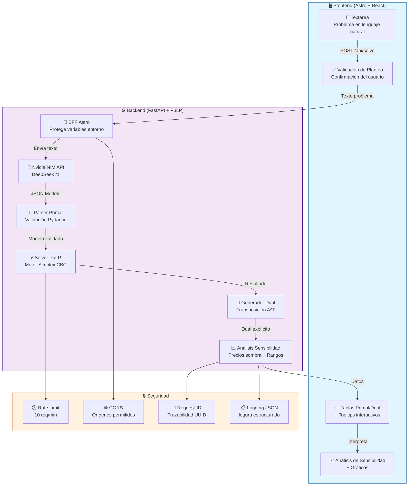
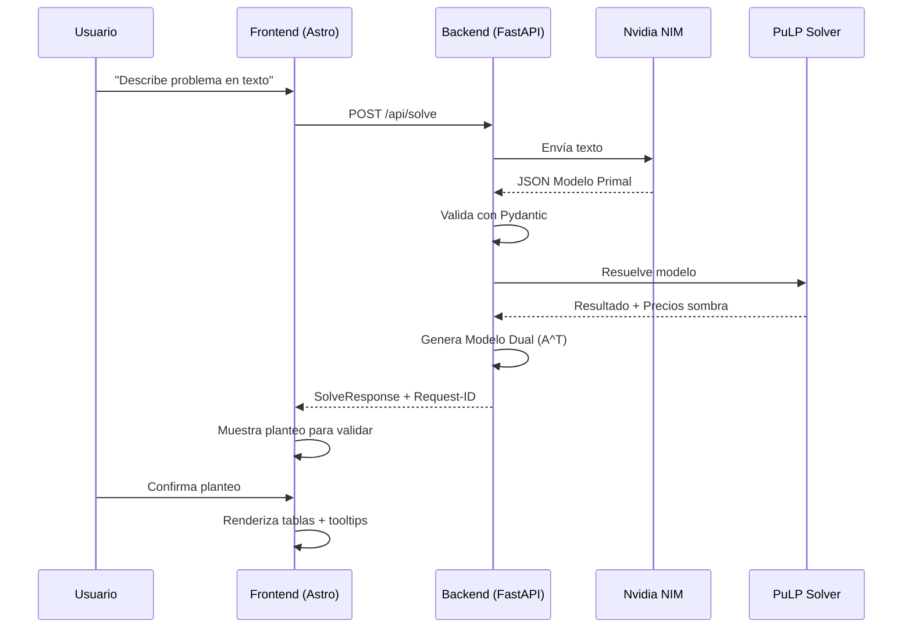
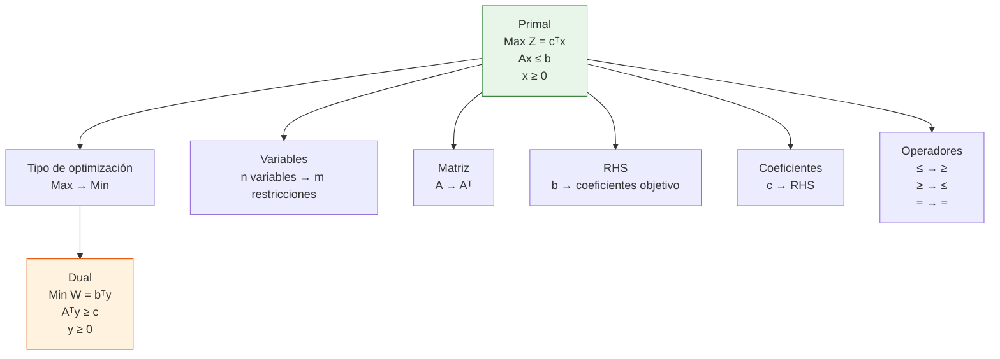
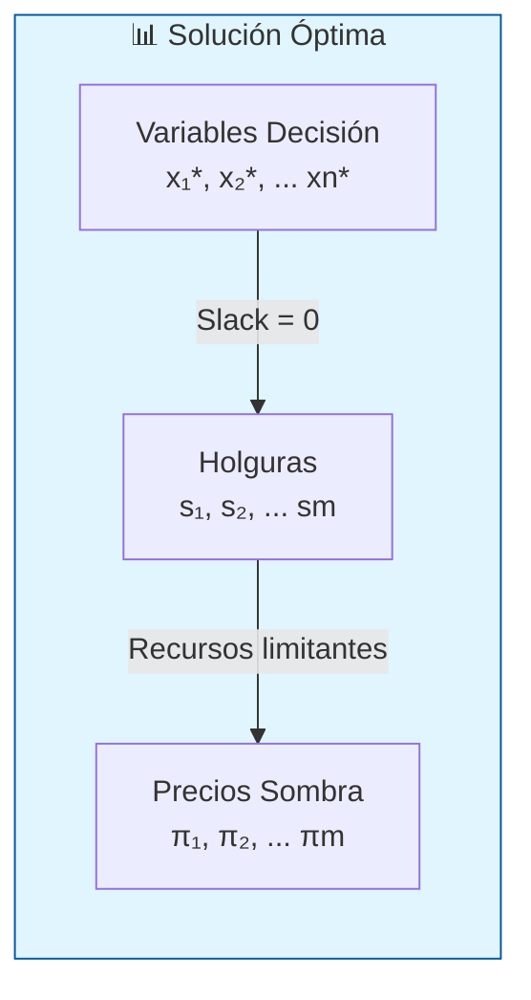

# LinSolve

**Plataforma SaaS de Programación Lineal con análisis Primal-Dual automático**

LinSolve permite a usuarios sin conocimientos matemáticos redactar problemas de optimización en lenguaje natural, transformarlos en modelos de Programación Lineal, resolverlos con PuLP y obtener un análisis de sensibilidad con lógica de negocio.

---

## Índice

- [Características](#características)
- [Arquitectura](#arquitectura)
- [Estructura de Directorios](#estructura-de-directorios)
- [Stack Tecnológico](#stack-tecnológico)
- [Requisitos](#requisitos)
- [Instalación Local](#instalación-local)
- [Configuración](#configuración)
- [Ejecución](#ejecución)
- [API Endpoints](#api-endpoints)
- [Testing](#testing)
- [Docker](#docker)
- [Despliegue](#despliegue)
- [Documentación Matemática](#documentación-matemática)

---

## Características

| Característica | Descripción |
|----------------|-------------|
| **Text-to-Math** | LLM (DeepSeek via Nvidia NIM) transforma lenguaje natural a modelo matemático |
| **Resolución PuLP** | Motor Simplex para resolver modelos Primal |
| **Modelo Dual Explícito** | Generación algorítmica con transposición de matriz A^T |
| **Análisis de Sensibilidad** | Precios sombra, costos reducidos, rangos de optimalidad |
| **Tooltips Matemáticos** | Explicaciones según Teorema de Dualidad Fuerte (Hillier & Lieberman) |
| **Validación de Planteo** | Usuario confirma interpretación antes de ver resultados |
| **Rate Limiting** | 10 requests/minuto por IP para proteger el servicio público |
| **Logging Estructurado** | Formato JSON con Request-ID para trazabilidad completa |
| **Type Safety** | Pydantic Models (Python) + TypeScript Interfaces (React) |

---

## Arquitectura



### Flujo de Datos



---

## Estructura de Directorios

```
LinSolve/
├── .env.example                     # Variables de entorno (copiar a .env)
├── docker-compose.yml               # Orquestación multi-contenedor
├── Dockerfile                       # Imagen del backend FastAPI
├── requirements.txt                 # Dependencias Python (pip)
├── README.md                        # Este archivo
│
├── backend/                         # ──────────────────────────────────
│   ├── __init__.py
│   ├── main.py                      # FastAPI app + endpoints + middleware
│   ├── models.py                    # Esquemas Pydantic (Primal/Dual/Response)
│   ├── solver.py                    # Motor PuLP + resolución primal
│   ├── dual_generator.py            # Transposición A^T → Modelo Dual
│   ├── validation.py                # Validador de restricciones + planteo texto
│   ├── prompts.py                   # System prompts para LLM
│   ├── logging_config.py            # Configuración loguru (JSON estructurado)
│   ├── solvers/                     # Módulo de solvers (extensible)
│   │   └── __init__.py
│   └── services/                    # Servicios externos (Nvidia API, etc.)
│       └── __init__.py
│
├── frontend/                        # ──────────────────────────────────
│   ├── Dockerfile                   # Imagen Astro + React para producción
│   └── src/
│       ├── types/
│       │   └── index.ts             # Interfaces TypeScript (sincronizadas con Pydantic)
│       ├── components/
│       │   ├── LinSolveApp.tsx      # Componente principal + flujo UX
│       │   └── PrimalDualTables.tsx # Renderizado tablas + tooltips
│       └── pages/
│           └── api/
│               └── solve.ts         # BFF Astro (protege variables entorno)
│
├── tests/                           # ──────────────────────────────────
│   ├── __init__.py
│   ├── test_solver.py               # Tests PuLP (patrón AAA)
│   ├── test_dual_generator.py       # Tests transposición A^T (AAA)
│   └── test_api.py                  # Tests endpoints FastAPI
│
└── app/                             # Módulo app (extensible)
    └── __init__.py
```

---

## Stack Tecnológico

| Capa | Tecnología | Propósito |
|------|------------|-----------|
| **Frontend** | Astro (SSR) + React | Protección de variables entorno + islas interactivas |
| **UI** | Tailwind CSS | Diseño responsivo |
| **Backend** | FastAPI (Python 3.11) | API REST de alto rendimiento |
| **Motor Matemático** | PuLP + CBC Solver | Resolución de Programación Lineal |
| **LLM Orchestration** | Nvidia NIM (DeepSeek r1) | Extracción de modelo + análisis de negocio |
| **Rate Limiting** | slowapi | Protección contra abuse (10 req/min) |
| **Validación** | Pydantic v2 | Tipado estricto entrada/salida |
| **Logging** | loguru | Logs JSON estructurados para hosting |
| **Testing** | pytest + pytest-cov | Tests AAA, cobertura >80% |
| **Container** | Docker + Docker Compose | Despliegue reproducible |

---

## Requisitos

- **Python 3.11+**
- **Node.js 20+** (para frontend)
- **Docker + Docker Compose** (para contenedores)
- **NVIDIA API Key** (para LLM DeepSeek)

---

## Instalación Local

### 1. Clonar el repositorio

```bash
git clone https://github.com/tu-usuario/linsolve.git
cd linsolve
```

### 2. Configurar variables de entorno

```bash
# Copiar el archivo de ejemplo
cp .env.example .env

# Editar .env con tu NVIDIA API Key
# NVIDIA_API_KEY=nvapi-xxxxxxxxxxxxxxxxxxxxxxxx
```

### 3. Backend (Python + FastAPI)

```bash
# Crear entorno virtual
python -m venv venv

# Activar entorno virtual
# Linux/Mac:
source venv/bin/activate
# Windows (PowerShell):
.\venv\Scripts\Activate.ps1
# Windows (CMD):
venv\Scripts\activate.bat

# Instalar dependencias
pip install -r requirements.txt

# Verificar instalación
python -c "import pulp; print(pulp.__version__)"

# Crear archivo .env con tu NVIDIA API Key
cp .env.example .env
# Editar .env y agregar: NVIDIA_API_KEY=nvapi-tu-key-aqui

# Ejecutar servidor
uvicorn backend.main:app --reload --host 0.0.0.0 --port 8000

# En otra terminal, verificar que funciona:
curl http://localhost:8000/health
```

### 4. Frontend (Astro + React)

```bash
cd frontend

# Crear archivo de configuración de entorno
echo "PUBLIC_BACKEND_URL=http://localhost:8000" > .env

# Instalar dependencias
npm install

# Ejecutar en desarrollo
npm run dev

# Abrir http://localhost:4321 en el navegador
```

### 5. Ejecutar Tests

```bash
# Desde la raíz del proyecto (backend)
pip install -r requirements.txt

# Ejecutar todos los tests
pytest tests/ -v

# Con coverage
pytest tests/ -v --cov=backend --cov-report=html --cov-report=term

# Tests específicos
pytest tests/test_solver.py -v
pytest tests/test_dual_generator.py -v
pytest tests/test_api.py -v
```

---

## Configuración

### Variables de Entorno (.env)

```env
# ─────────────────────────────────────────────
# LinSolve - Configuración Local
# ─────────────────────────────────────────────

# Nvidia NIM API Key (requerida para LLM)
NVIDIA_API_KEY=nvapi-tu-key-aqui
NVIDIA_API_URL=https://integrate.api.nvidia.com/v1/chat/completions
NVIDIA_MODEL=deepseek-ai/deepseek-v4-pro

# Orígenes CORS permitidos (separados por coma)
ALLOWED_ORIGINS=http://localhost:4321,http://localhost:3000

# Rate limiting (10 requests por minuto por IP)
RATE_LIMIT=10/minute

# Nivel de logging: DEBUG (desarrollo) o INFO (producción)
LOG_LEVEL=DEBUG

# Entorno de ejecución
ENVIRONMENT=development

# URL del backend (para BFF de Astro)
PUBLIC_BACKEND_URL=http://localhost:8000
```

---

## Ejecución

### Modo Desarrollo (Docker Compose)

```bash
# Levantar todos los servicios
docker-compose up --build

# Ver logs en tiempo real
docker-compose logs -f backend

# Detener servicios
docker-compose down
```

**URLs:**
- Frontend: http://localhost:4321
- Backend API: http://localhost:8000
- Docs Swagger: http://localhost:8000/docs

### Backend Solo (Python)

```bash
# Activar entorno virtual
source venv/bin/activate

# Ejecutar con uvicorn
uvicorn backend.main:app --reload --host 0.0.0.0 --port 8000

# Verificar health
curl http://localhost:8000/health
```

### Frontend Solo (Astro)

```bash
cd frontend
npm run dev
```

### Tests

```bash
# Todos los tests con coverage
pytest tests/ -v --cov=backend --cov-report=html

# Solo tests de solver
pytest tests/test_solver.py -v

# Solo tests de dual
pytest tests/test_dual_generator.py -v

# Solo tests de API
pytest tests/test_api.py -v

# Ver report de coverage
open htmlcov/index.html
```

---

## API Endpoints

### Health Check

```http
GET /health
```

**Respuesta:**
```json
{
  "status": "healthy",
  "service": "LinSolve"
}
```

### Resolver Problema

```http
POST /api/solve
Content-Type: application/json

{
  "problema_texto": "Una empresa produce dos productos A y B. Cada unidad de A genera $3 de ganancia y requiere 2 horas de mano de obra. Cada unidad de B genera $5 de ganancia y requiere 3 horas de mano de obra. Hay disponibles 100 horas de mano de obra."
}
```

**Headers de respuesta:**
```
X-Request-ID: 550e8400-e29b-41d4-a716-446655440000
```

**Respuesta (200 OK):**
```json
{
  "estado": "OPTIMO",
  "modelo_primal_valido": {
    "funcion_objetivo_texto": "MAX Z = 3*x1 + 5*x2",
    "restricciones_texto": ["R1: 2*x1 + 3*x2 <= 100"],
    "variables_texto": ["x1 >= 0", "x2 >= 0"]
  },
  "resultado_variables": [...],
  "resultado_restricciones": [...],
  "modelo_dual": {
    "tipo_optimizacion": "min",
    "funcion_objetivo": "Min W = 100y1",
    "restricciones": [...]
  },
  "analisis_sensibilidad": {...},
  "tiempo_resolucion_ms": 45.2,
  "request_id": "550e8400-e29b-41d4-a716-446655440000"
}
```

### Códigos de Error

| Código | Descripción |
|--------|-------------|
| `400` | Bad Request - JSON malformado |
| `403` | Forbidden - Origen CORS no permitido |
| `404` | Not Found - Endpoint no existe |
| `422` | Unprocessable Entity - Esquema Pydantic inválido |
| `429` | Too Many Requests - Rate limit excedido |
| `500` | Internal Server Error - Error en PuLP |
| `502` | Bad Gateway - Error en comunicación con Nvidia API |

---

## Testing

### Estructura de Tests (Patrón AAA)

```python
def test_generar_dual_max_to_min(self):
    # Arrange: preparar datos
    primal = ModeloPrimal(tipo_optimizacion="max", ...)

    # Act: ejecutar la función
    dual = DualGenerator.generar(["x1", "x2"], primal)

    # Assert: verificar resultado
    assert dual.tipo_optimizacion == "min"
```

### Cobertura Mínima: 80%

```bash
# Generar report HTML
pytest tests/ --cov=backend --cov-report=html --cov-report=term

# Verificar cobertura por archivo
pytest tests/ --cov=backend --cov=backend/models --cov=backend/solver --cov=backend/dual_generator
```

---

## Docker

### Build Manual

```bash
# Build imagen backend
docker build -t linsolve-backend .

# Build imagen frontend
docker build -t linsolve-frontend -f frontend/Dockerfile .

# Run contenedor backend
docker run -d -p 8000:8000 --env-file .env linsolve-backend

# Run contenedor frontend
docker run -d -p 4321:4321 linsolve-frontend
```

### Docker Compose (Recomendado)

```yaml
services:
  backend:
    build: .
    ports:
      - "8000:8000"
    env_file:
      - .env
    healthcheck:
      test: ["CMD", "python", "-c", "import httpx; httpx.get('http://localhost:8000/health').raise_for_status()"]
      interval: 30s
      timeout: 10s
      retries: 3

  frontend:
    build: ./frontend
    ports:
      - "4321:4321"
    environment:
      - PUBLIC_BACKEND_URL=http://backend:8000
```

---

## Despliegue

### Render (Recomendado)

1. Conectar repo de GitHub
2. Crear servicio web para backend con `Dockerfile`
3. Configurar variables de entorno en dashboard
4. Deploy automático en cada push

```bash
# Render detected automatically from Dockerfile
render.yaml create --type=web --name=linsolve-backend
```

### Railway

```bash
# Instalar CLI
npm install -g @railway/cli

# Deploy
railway login
railway init
railway up
```

---

## Documentación Matemática

### Teoría de Dualidad (Hillier & Lieberman)

```mermaid
flowchart LR
    subgraph PRIMAL["📐 PRIMAL (Original)"]
        direction TB
        P1["Max Z = cᵀx"]
        P2["s.a. Ax ≤ b"]
        P3["x ≥ 0"]
    end

    subgraph TRANSFORM["🔄 Transformación"]
        direction TB
        T1["Transponer A → Aᵀ"]
        T2["Intercambiar b ↔ c"]
        T3["Invertir operadores"]
    end

    subgraph DUAL["📐 DUAL (Optimización)")
        direction TB
        D1["Min W = bᵀy"]
        D2["s.a. Aᵀy ≥ c"]
        D3["y ≥ 0"]
    end

    PRIMAL -->|"Hillier & Lieberman<br/>Capítulo 6"| TRANSFORM
    TRANSFORM -->|"Dualidad Fuerte<br/>Z* = W*"| DUAL

    style PRIMAL fill:#e3f2fd,stroke:#1565c0
    style DUAL fill:#f3e5f5,stroke:#7b1fa2
    style TRANSFORM fill:#fff9c4,stroke:#f57f17
```

### Transformaciones Primal → Dual



### Interpretación de Resultados

| Concepto | Symbol | Interpretation |
|----------|--------|----------------|
| **Holgura = 0** | Slack | Restricción ACTIVA (recurso limitante) |
| **Precio Sombra** | πᵢ | Valor marginal de cada unidad del recurso |
| **Z = W** | Dualidad Fuerte | Soluciones óptimas Primal y Dual son iguales |
| **Costo Reducido** | dj | Cuánto puede empeorar un coeficiente antes de cambiar solución |



---

## Licencia

MIT License - Ver [LICENSE](LICENSE) para más detalles.

---

## Autores

- **LinSolve Team** - Desarrollo y documentación matemática

---

## Referencias

- Hillier, S. & Lieberman, G. (2020). *Introducción a la Investigación de Operaciones* (10ª ed.). McGraw-Hill.
- PuLP Documentation: https://coin-or.github.io/pulp/
- FastAPI Documentation: https://fastapi.tiangolo.com/
- Nvidia NIM API: https://docs.nvidia.com/nim/